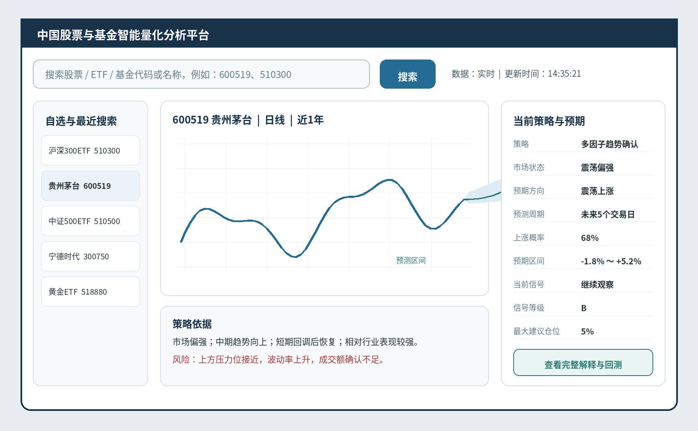

# 产品规格说明

> **Source of truth:** 产品范围、用户体验、功能需求、GUI、策略展示和产品验收。需求变更必须同步更新 `../TRACEABILITY.md` 与 `../../spec/requirements.yaml`。

| **文档版本** | V1.0                                   |
|--------------|----------------------------------------|
| **文档日期** | 2026年6月28日                          |
| **目标市场** | 中国A股、场内ETF/LOF、场外公募基金     |
| **技术形态** | Python桌面应用，联网获取历史与实时数据 |
| **文档状态** | 需求基线，可用于GUI深化与工程立项      |

**核心原则：以国际通用金融理论为基础，以中国市场规则为执行约束，以样本外验证和风险控制为上线门槛。**

# 文档控制

| **项目**   | **内容**                                                    |
|------------|-------------------------------------------------------------|
| 文档目的   | 作为产品立项、GUI深化、量化研究、开发实施和验收的统一基线。 |
| 需求提出方 | 项目发起人 / 个人投资研究用户                               |
| 文档维护方 | 产品与量化研发团队                                          |
| 变更原则   | 重大范围、交易规则、模型目标或验收门槛变更必须记录版本。    |
| 保密级别   | 内部设计资料；对外发布前需完成合规和知识产权复核。          |

## 版本记录

| **版本** | **日期**   | **说明**                                                 |
|----------|------------|----------------------------------------------------------|
| V0.1     | 2026-06    | 初步提出行情、搜索、策略和回测需求。                     |
| V0.2     | 2026-06    | 明确中国股票和基金范围、实时数据与盈利导向。             |
| V0.3     | 2026-06    | 补充GUI折线图、策略说明和预期走势。                      |
| V0.4     | 2026-06    | 将核心理论调整为国际通用金融理论，中国规则作为执行约束。 |
| V1.0     | 2026-06-28 | 汇总形成正式产品与技术需求基线。                         |

# 1. 执行摘要

本产品是一套使用Python开发、需要联网运行的中国股票与基金智能量化分析桌面工具。系统通过证券代码或名称搜索切换标的，展示实时与历史价格折线图、K线和成交量，并基于国际通用金融理论、中国市场数据和本地交易规则，输出可解释的策略状态、预期走势、风险区间和操作信号。

系统的核心不是“每天荐股”，而是建立一套可验证、可回溯、可解释的量化决策流程：在满足数据质量、统计显著性、交易可执行性和风险预算的前提下，识别正期望机会；不满足条件时明确输出“不交易”。

| **产品承诺边界：**目标是提高长期风险调整后收益和决策质量，不保证单笔交易正确，也不承诺固定收益。任何预测必须以概率、区间和失效条件表达。 |
|------------------------------------------------------------------------------------------------------------------------------------------|

## 1.1 项目目标

- 支持中国A股、场内ETF/LOF及场外公募基金的历史与当日数据分析。

- 提供代码/名称搜索、证券切换、实时与历史折线图、技术指标和大盘概览。

- 以国际通用金融理论建立因子、组合和风险框架，以中国交易规则约束执行。

- 构建无未来数据泄漏、包含交易成本和不可成交约束的回测系统。

- 输出买入、持有、减仓、卖出、观察或不交易信号，并解释依据与风险。

- 先进行样本外回测和模拟盘验证，再评估是否扩展到真实交易接口。

## 1.2 成功定义

产品成功不以“预测每次都对”为标准，而以扣除成本后的正期望、可接受回撤、概率校准、策略稳定性、信号可解释性和实际可执行性综合衡量。

# 2. 产品愿景与原则

## 2.1 产品愿景

| **愿景：**成为个人用户研究中国股票与基金时可信赖的量化分析工作台：既能看行情，也能理解策略为什么这样判断，更能通过严格回测验证判断是否有效。 |
|----------------------------------------------------------------------------------------------------------------------------------------------|

## 2.2 设计原则

| **原则**               | **产品含义**                                                                      |
|------------------------|-----------------------------------------------------------------------------------|
| 盈利导向但不承诺盈利   | 优化目标是长期净收益与风险调整收益，而不是追求表面胜率。                          |
| 理论国际化、执行本地化 | 金融理论采用国际主流框架；T+1、涨跌停、停牌和基金确认规则由中国市场规则引擎处理。 |
| 先验证、后上线         | 未通过样本外、滚动验证、成本压力测试和模拟盘的策略不得进入正式信号。              |
| 概率而非确定性         | 未来走势展示概率分布、预测区间和置信度，不显示“必涨”或单一确定价格。              |
| 允许不交易             | 当数据异常、信号冲突、预期收益不足或风险过高时，输出不交易。                      |
| 解释优先               | 每个信号显示支持因素、反对因素、关键阈值和失效条件。                              |
| 规则可追溯             | 每次回测和信号记录数据版本、模型版本和交易规则有效日期。                          |
| 组合优先于单股         | 单股预测必须服从组合风险、相关性、行业集中度和仓位上限。                          |

# 3. 用户与场景

## 3.1 目标用户

- 主要用户：希望使用量化方法辅助分析中国股票、ETF和基金的个人投资研究者。

- 次要用户：需要验证策略、复盘交易或观察市场状态的量化研究人员。

- 暂不面向：需要机构级高频交易、托管多用户资产或公开收费荐股的业务。

## 3.2 核心用户故事

| **编号** | **用户故事**                                                                    | **优先级** |
|----------|---------------------------------------------------------------------------------|------------|
| US-01    | 作为用户，我输入600519后，系统立即切换到贵州茅台，并加载历史和实时行情。        | P0         |
| US-02    | 作为用户，我可以切换分时、分钟、日线和自定义历史区间。                          | P0         |
| US-03    | 作为用户，我能看到当前使用的策略名称、周期、参数摘要和适用条件。                | P0         |
| US-04    | 作为用户，我能看到未来若干交易日的方向概率、收益区间和风险区间。                | P0         |
| US-05    | 作为用户，我能理解系统为什么给出观察、买入、减仓或卖出信号。                    | P0         |
| US-06    | 作为用户，我能选择历史区间运行回测，并查看交易明细、收益和最大回撤。            | P0         |
| US-07    | 作为用户，我能查看ETF轮动和场外基金中长期分析，而不会把基金估值误认为成交净值。 | P1         |
| US-08    | 作为用户，我能通过知识提示理解K线、T+1、回撤、ETF和概率预测。                   | P1         |

# 4. 产品范围与边界

## 4.1 MVP范围

| **模块** | **MVP包含**                                                                      |
|----------|----------------------------------------------------------------------------------|
| 市场     | 沪深A股、主要宽基/行业/资产类ETF；场外基金日频分析。                             |
| 数据     | 证券主数据、交易日历、历史日线、分钟线、当日行情、复权因子、基础财务与基金净值。 |
| 界面     | 搜索框、自选、折线/K线、策略面板、预期走势、信号解释、回测页、模拟账户。         |
| 策略     | ETF中期轮动基准策略；A股市场过滤+多因子+趋势确认策略。                           |
| 模型     | 概率分类/排序与区间预测；不以深度学习为首要方案。                                |
| 验证     | 单标的和组合回测、滚动样本外验证、成本/滑点/涨跌停/停牌模拟。                    |
| 运行     | 桌面应用，联网获取数据，本地缓存和报告导出。                                     |

## 4.2 暂不纳入MVP

- 真实账户自动下单

- 高频和超短线交易

- 期货、期权、融资融券

- 公开收费荐股或多用户资产管理

- 完全自动的黑盒调参

- 依赖未经许可的爬虫作为核心数据源

## 4.3 产品边界

| **重要边界：**GUI中的“预期走势”是模型概率和区间的可视化，不是保证未来价格按某条曲线运行；场外基金的盘中估算不得作为正式净值或回测成交价。 |
|-------------------------------------------------------------------------------------------------------------------------------------------|

# 5. 资产与数据范围

## 5.1 资产分类

| **资产**     | **数据频率**         | **交易/分析特点**                                        | **首版策略**             |
|--------------|----------------------|----------------------------------------------------------|--------------------------|
| A股股票      | 实时、分钟、日/周/月 | 受交易日、涨跌停、停复牌、当日回转限制和公司事件影响。   | 5-20日多因子趋势策略     |
| 场内ETF/LOF  | 实时、分钟、日频     | 实时成交；是否支持当日回转必须按产品属性和有效规则判断。 | 中期轮动、趋势和风险控制 |
| 场外公募基金 | 正式日净值为主       | 申购赎回按基金文件确认；盘中估值仅供参考。               | 周/月度筛选、定投与配置  |
| 市场指数     | 实时、分钟、日频     | 用于基准、市场状态和相对强弱。                           | 市场过滤与绩效基准       |

## 5.2 数据原则

- 数据服务通过统一适配器接入，业务代码不得绑定单一供应商。

- 正式生产信号所需数据必须具有明确授权、更新时间、字段定义和质量状态。

- 实时数据中断、时间戳异常或关键字段缺失时暂停生成新信号。

- 历史回测只能使用当时已经公开的数据和当时有效的证券池、财务信息与规则。

- 场外基金正式净值与盘中估值在界面、存储和回测中完全隔离。

# 6. 核心用户旅程

## 6.1 搜索与切换

1.  用户在顶部搜索框输入代码、名称或简称。

2.  系统返回代码、名称、资产类型、市场和最新状态。

3.  用户选择结果后，系统取消旧标的实时订阅并切换当前证券。

4.  优先显示本地缓存历史数据，同时后台补齐缺失区间。

5.  建立新标的实时订阅，刷新折线图、K线、指标和盘口。

6.  运行策略与风险评估，更新当前策略、预期走势和信号解释。

7.  若数据不足或异常，显示明确原因，不产生操作信号。

## 6.2 策略分析

8.  用户选择策略或采用默认策略。

9.  系统判断市场状态和标的可交易性。

10. 系统计算因子、概率和收益/回撤区间。

11. 风险引擎检查仓位、相关性、事件和执行约束。

12. 界面输出最终信号、有效期、触发条件和失效条件。

## 6.3 回测验证

13. 用户选择策略、标的池、区间和资金参数。

14. 系统锁定数据快照、规则版本和模型版本。

15. 事件驱动引擎按可实现成交顺序回放。

16. 系统输出净值、回撤、交易明细、基准对比和稳定性报告。

17. 不满足门槛的策略只能标记为研究状态。

图1 策略从市场状态到最终信号的产品级决策链

# 7. 产品功能需求

| **编号** | **功能** | **需求说明**                                                         | **优先级** |
|----------|----------|----------------------------------------------------------------------|------------|
| FR-001   | 证券搜索 | 支持股票、ETF、LOF、场外基金代码与名称搜索；支持模糊匹配和最近记录。 | P0         |
| FR-002   | 证券切换 | 选中结果后同步切换图表、实时订阅、策略和风险面板。                   | P0         |
| FR-003   | 历史行情 | 展示日/周/月及可用分钟周期，支持日期范围、缩放、拖动和十字光标。     | P0         |
| FR-004   | 实时行情 | 展示最新价、涨跌、成交量额和数据更新时间；断线自动重连。             | P0         |
| FR-005   | 图表叠加 | 支持均线、成交量、波动率、预测区间和历史信号标记。                   | P0         |
| FR-006   | 当前策略 | 显示策略名、版本、周期、适用条件、关键参数和市场状态。               | P0         |
| FR-007   | 预期走势 | 显示方向分类、上涨/横盘/下跌概率、收益区间、回撤区间和置信度。       | P0         |
| FR-008   | 交易信号 | 输出买入、加仓、持有、减仓、卖出、观察或不交易。                     | P0         |
| FR-009   | 解释系统 | 展示支持因素、反对因素、触发阈值、失效条件和相似样本。               | P0         |
| FR-010   | 市场概览 | 展示主要指数、全市场广度、成交额、波动与市场状态。                   | P0         |
| FR-011   | 自选管理 | 支持添加、删除、分组、排序及信号概览。                               | P1         |
| FR-012   | 技术指标 | 支持SMA/EMA、MACD、RSI、ATR、布林带、VWAP等；指标仅作为特征。        | P0         |
| FR-013   | 回测任务 | 支持单证券、组合、ETF轮动和参数对比回测。                            | P0         |
| FR-014   | 回测报告 | 输出收益、最大回撤、风险调整指标、交易明细和基准对比。               | P0         |
| FR-015   | 模拟账户 | 支持模拟资金、持仓、订单、交易成本和信号跟踪。                       | P1         |
| FR-016   | 基金分析 | 区分场内价格与场外净值，提供费用、回撤、风险和同类比较。             | P1         |
| FR-017   | 知识中心 | 提供K线、T+1、ETF、基金净值、回撤、胜率和概率校准解释。              | P1         |
| FR-018   | 策略配置 | 允许选择策略和风险偏好；高级参数需确认后修改并保留版本。             | P1         |
| FR-019   | 报告导出 | 导出CSV、HTML或PDF/图片形式的回测与策略报告。                        | P1         |
| FR-020   | 审计追踪 | 保存信号所用数据时间、模型版本、规则版本和计算摘要。                 | P0         |

# 8. GUI与交互设计

图2 首版主界面信息架构示意（视觉样式可在GUI阶段继续深化）

## 8.1 主界面布局

| **区域**  | **内容**                                             | **交互要求**                              |
|-----------|------------------------------------------------------|-------------------------------------------|
| 顶部      | 搜索框、搜索按钮、数据状态、更新时间、设置。         | 输入后300ms防抖；键盘上下选择；回车确认。 |
| 左侧      | 自选、最近搜索、主要指数。                           | 点击即切换；支持分组和固定。              |
| 中间      | 实时/历史折线图、K线、成交量、指标、预测带。         | 周期切换、缩放、拖动、悬停详情。          |
| 右侧      | 当前策略、市场状态、预期走势、概率、操作信号和仓位。 | 关键状态颜色区分，但必须同时使用文字。    |
| 底部/页签 | 行情、策略详情、回测、模拟账户、风险分析、知识中心。 | 保持当前证券上下文。                      |

## 8.2 折线图要求

- 支持分时、1/5/15/30/60分钟、日/周/月和自定义日期；无权限周期显示不可用原因。

- 实时数据增量更新，不全量重绘；切换标的时显示骨架屏而非冻结界面。

- 历史买入、卖出、止损和止盈点可点击查看当时理由及后续表现。

- 预测区域使用虚线/半透明置信带，并标注“预测区间，不代表确定未来价格”。

- 前复权、不复权和后复权选择明确；策略回测使用一致的价格与公司行为处理。

## 8.3 策略与预期面板

| **字段**     | **示例**                    | **说明**                                          |
|--------------|-----------------------------|---------------------------------------------------|
| 当前策略     | A股多因子趋势确认 V1.0      | 显示版本、周期和策略状态。                        |
| 市场状态     | 震荡偏强                    | 由市场状态模型输出。                              |
| 预期方向     | 震荡上涨                    | 强势上涨/震荡上涨/横盘/震荡下跌/强势下跌/不明确。 |
| 概率         | 上涨68% / 横盘20% / 下跌12% | 必须经过样本外概率校准。                          |
| 预期收益区间 | -1.8% ～ +5.2%              | 显示周期和覆盖概率。                              |
| 预期最大回撤 | 约2.6%                      | 用于风险比较，不是保证上限。                      |
| 当前信号     | 继续观察（B级）             | 必须显示原因、触发条件和有效期。                  |
| 建议仓位上限 | 5%                          | 来自组合风险预算，不是固定模板。                  |

## 8.4 状态与异常提示

- 正在搜索

- 正在加载历史数据

- 正在连接实时行情

- 策略计算中

- 数据延迟

- 数据异常暂停信号

- 样本不足

- 回测进行中

- 规则版本待更新

# 9. 策略、预测与解释

## 9.1 理论框架

核心策略理论采用国际上广泛认可的金融与统计框架，包括现代投资组合理论、CAPM与风险调整绩效、多因子资产定价、动量与均值回归、行为金融、波动率建模和严格的时间序列验证。K线形态、均线和技术指标属于价格行为特征，不得单独作为理论或高置信度买入依据。

## 9.2 首版策略

| **策略**      | **标的**                          | **周期**                | **核心逻辑**                                     | **输出**                     |
|---------------|-----------------------------------|-------------------------|--------------------------------------------------|------------------------------|
| ETF中期轮动   | 宽基、行业、黄金、债券、货币等ETF | 日频计算，周度/条件调仓 | 相对动量+趋势+波动率控制+相关性约束              | 持有标的、权重、现金比例     |
| A股多因子趋势 | 流动性良好的沪深股票池            | 5-20个交易日            | 市场过滤+价值/质量/动量/低波+趋势确认+风险过滤   | 评分、概率、信号、仓位与止损 |
| 场外基金分析  | 股票/混合/债券/指数基金           | 周/月频                 | 收益、回撤、风险调整表现、费用、经理与风格稳定性 | 观察/持有/调仓建议           |

## 9.3 预测定义

模型预测对象不是一个精确未来价格，而是未来N个交易日扣除成本后的收益分布、达到目标收益的概率、先触发止损的概率、最大不利变动以及相对基准表现。1日、5日、10日和20日模型必须分开训练和评估。

## 9.4 信号规则

市场环境合格  
且 标的可交易与流动性合格  
且 综合评分达到阈值  
且 预期净收益 > 交易成本 + 安全边际  
且 预期盈亏比和下行风险满足要求  
且 组合风险预算允许  
=> 才能产生买入候选；否则观察或不交易。

## 9.5 可解释性

- 显示贡献最大的正向因子和负向因子。

- 显示市场状态、流动性、事件风险和组合约束如何改变最终信号。

- 显示历史相似样本数量、胜率、平均收益、平均亏损和置信区间。

- 显示当前信号失效条件，例如跌破趋势线、波动率突升、数据过期或公告事件。

# 10. 回测、模拟与风险

## 10.1 回测原则

- 严格按时间顺序训练、验证和测试，禁止随机打乱时间序列。

- 信号在T日收盘后生成时，成交不得假设发生在T日未知价格。

- 纳入佣金、印花税、过户费、滑点、买卖价差和成交量限制。

- 按有效日期应用当时交易规则；处理停牌、涨跌停、公司行为和退市。

- 证券池应尽量包含历史退市、ST变化和当时成分，降低幸存者偏差。

- 模型调参不能反复查看最终测试集；使用滚动验证和隔离区降低泄漏。

## 10.2 风险管理

| **风险维度**    | **首版控制**                                       |
|-----------------|----------------------------------------------------|
| 单笔风险        | 按账户净值和止损距离计算数量，默认风险预算可配置。 |
| 单标的集中度    | 设置最大仓位，避免单一公司风险。                   |
| 行业/主题集中度 | 限制同类高相关标的总权重。                         |
| 组合回撤        | 达到阈值后降低仓位或暂停新开仓。                   |
| 市场状态        | 偏弱/高风险状态提高阈值并增加现金。                |
| 流动性          | 按平均成交额、价差和参与率限制可交易数量。         |
| 模型风险        | 监控概率校准、因子漂移和实盘/回测偏差。            |

## 10.3 模拟盘

回测合格后进入模拟盘。模拟盘记录信号到达时间、实际可得报价、预期与实际滑点、漏单/重复信号、网络中断和数据延迟。未通过稳定运行和偏差复核，不进入真实账户连接阶段。

# 11. 产品指标与上线门槛

## 11.1 产品体验指标

| **指标**   | **目标/要求**                                           |
|------------|---------------------------------------------------------|
| 搜索响应   | 本地索引候选返回目标<300ms；远端补充异步完成。         |
| 证券切换   | 优先显示缓存；主界面可交互目标<1秒，完整策略异步更新。 |
| 实时状态   | 始终显示数据时间和延迟状态。                            |
| 解释覆盖率 | 所有操作信号必须具备支持/反对因素和失效条件。           |
| 错误保护   | 关键数据异常时新信号阻断率100%。                        |

## 11.2 策略研究门槛

具体数值需在研究阶段按策略类型确定，但至少必须满足以下硬性条件：

- 最终样本外净收益在扣除成本后为正，并与合理基准比较。

- 最大回撤和尾部亏损处于预先设定的风险预算内。

- 参数轻微变化、年份变化和市场状态变化不会导致结果完全失效。

- 概率预测经过校准，声明为70%的事件长期发生率应接近70%。

- 交易次数和样本量足以支持结论，不能以少量偶然交易证明有效。

- 模拟盘表现与回测假设偏差处于允许范围。

# 12. 路线图与版本规划

| **阶段**          | **主要交付**                                                | **退出条件**                         |
|-------------------|-------------------------------------------------------------|--------------------------------------|
| 阶段1：数据与骨架 | 证券主数据、历史/实时适配器、本地缓存、交易日历、质量检查。 | 指定标的可稳定查询，数据异常可检测。 |
| 阶段2：GUI原型    | 搜索、切换、折线/K线、自选、策略和预期面板。                | 交互不卡顿，数据状态明确。           |
| 阶段3：回测核心   | 事件驱动成交、规则版本、成本、组合和绩效。                  | 通过单元、回归和无泄漏审计。         |
| 阶段4：首版策略   | ETF轮动、A股多因子、概率预测和解释。                        | 通过样本外门槛。                     |
| 阶段5：模拟盘     | 实时信号、模拟订单、持仓和偏差监控。                        | 稳定运行并完成复核。                 |
| 阶段6：扩展       | 场外基金、更多策略、服务端或合规券商接口。                  | 单独立项和合规评估。                 |

# 13. 风险、合规与治理

## 13.1 规则版本治理

交易规则不能硬编码为永久常量。规则库必须记录市场、资产类型、生效日期、失效日期、来源文件和审核状态。当前沪深交易所已发布2026年修订版交易规则，并设置了具体生效日期，这进一步说明回测必须按交易日期选择正确规则版本。\[R1\]\[R2\]

## 13.2 程序化交易边界

MVP只生成研究信号和模拟交易。若未来通过计算机程序自动生成或下达真实交易指令，需要在接入前评估并落实适用的报告、系统接入、风险监控和异常交易管理要求。\[R3\]

## 13.3 模型与数据治理

- 模型登记：名称、版本、训练区间、因子、超参数、负责人和状态。

- 数据血缘：供应商、字段、更新时间、修订记录和质量检查。

- 信号审计：保存输入摘要、模型输出、规则过滤和最终决策。

- 变更审核：影响历史结果的策略/规则/成本变更必须重新回测。

# 14. 验收标准

| **编号** | **验收条件**                                                      |
|----------|-------------------------------------------------------------------|
| AC-01    | 输入有效代码或名称后返回正确候选并完成证券切换。                  |
| AC-02    | 切换证券后实时/历史图、策略、预期和信号使用同一标的与时间上下文。 |
| AC-03    | 折线图支持周期切换、缩放、悬停、信号标记和预测区间。              |
| AC-04    | 页面明确显示策略名称、版本、周期、逻辑摘要和适用/失效条件。       |
| AC-05    | 预期走势使用概率与区间，不出现确定性收益或必涨描述。              |
| AC-06    | 数据中断或异常时暂停新信号并显示原因。                            |
| AC-07    | 回测不存在已知未来数据泄漏，成交时序可通过测试复现。              |
| AC-08    | 回测纳入成本、滑点、涨跌停、停牌、当日回转与规则有效日期。        |
| AC-09    | 同一数据快照、参数、模型和规则版本产生完全一致的结果。            |
| AC-10    | 所有信号可追溯到数据时间、模型版本、规则版本和解释。              |
| AC-11    | 股票、场内基金和场外基金在数据与交易逻辑上不会混用。              |
| AC-12    | 未通过样本外与模拟盘门槛的策略不会标记为生产可用。                |

# 15. 术语与参考体系

## 15.1 关键术语

| **术语**     | **定义**                                                 |
|--------------|----------------------------------------------------------|
| K线/OHLC     | 特定周期内的开盘、最高、最低和收盘价格表达。             |
| T+1/当日回转 | 交易或确认的时间约束；具体含义必须按资产与业务场景区分。 |
| 正期望       | 长期平均收益在扣除成本后为正。                           |
| 最大回撤     | 净值从历史高点到后续低点的最大跌幅。                     |
| 概率校准     | 模型给出的概率与长期实际发生频率相符。                   |
| 样本外       | 模型开发和调参时未使用的数据。                           |
| 未来数据泄漏 | 在历史时点使用当时不可能获得的信息。                     |
| 规则有效日期 | 交易规则正式开始适用和停止适用的日期范围。               |

## 15.2 国际通用理论参考

| **编号** | **参考**                                              | **用途**                   |
|----------|-------------------------------------------------------|----------------------------|
| F1       | Markowitz, H. (1952). Portfolio Selection.            | 现代投资组合理论与分散化。 |
| F2       | Sharpe, W. F. (1964). Capital Asset Prices.           | CAPM、Beta和风险调整收益。 |
| F3       | Fama, E. F. & French, K. R. (1993; 2015).             | 多因子资产定价。           |
| F4       | Jegadeesh, N. & Titman, S. (1993).                    | 横截面动量的经典实证。     |
| F5       | Engle, R. F. (1982).                                  | ARCH与时变波动率。         |
| F6       | Black, F. & Litterman, R. (1992).                     | 组合观点与均衡收益融合。   |
| F7       | Bailey等关于回测过拟合、Deflated Sharpe Ratio的研究。 | 策略选择偏差和统计显著性。 |

## 15.3 官方规则与资料来源

| **编号** | **资料**                                         | **链接**                                                                                                               |
|----------|--------------------------------------------------|------------------------------------------------------------------------------------------------------------------------|
| R1       | 上海证券交易所交易规则（2026年修订）             | [打开官方资料](https://www.sse.com.cn/lawandrules/sselawsrules2025/trade/universal/c/c_20260424_10816492.shtml) |
| R2       | 深圳证券交易所交易规则（2026年修订）             | [打开官方资料](https://docs.static.szse.cn/www/lawrules/rule/trade/current/W020260424690713155663.pdf)          |
| R3       | 中国证监会《证券市场程序化交易管理规定（试行）》 | [打开官方资料](https://www.csrc.gov.cn/csrc/c101954/c7480579/content.shtml)                                     |
| R4       | 中国证券投资基金业协会投资者教育与公募基金资料   | [打开官方资料](https://investor.amac.org.cn/)                                                                   |

注：正式开发和回测时，应从官方站点获取当前有效版本，并由规则治理流程审核后更新。
