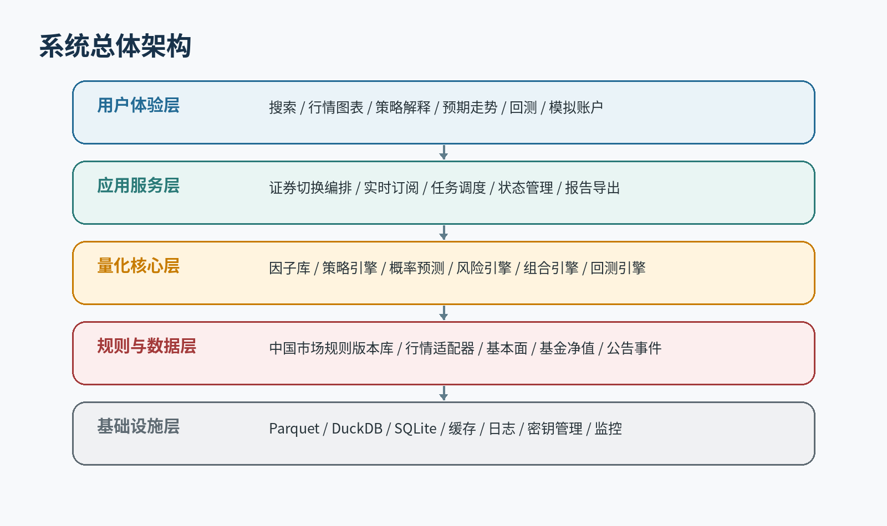
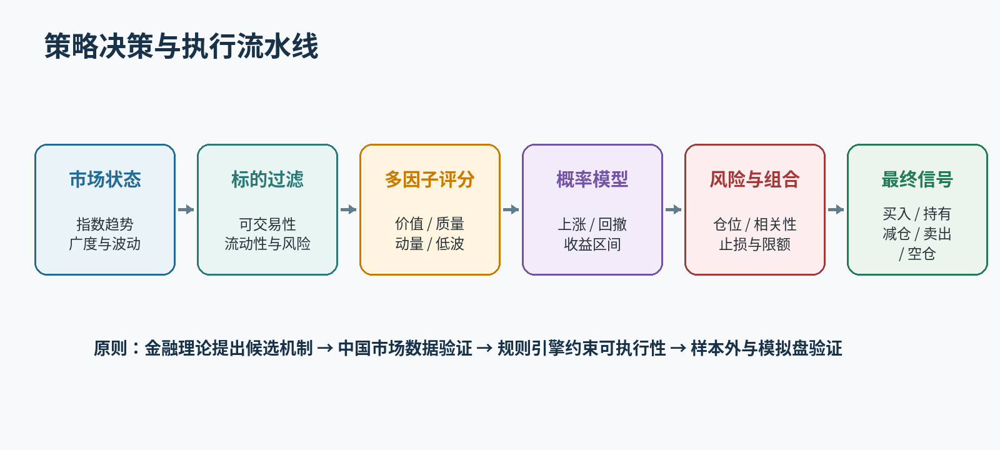

# 技术规格说明

> **Source of truth:** 系统架构、数据、算法、回测、风控、测试、部署和工程验收。实现不得绕过本文定义的规则引擎、数据质量门禁或可复现要求。

| **文档版本** | V1.0                                   |
|--------------|----------------------------------------|
| **文档日期** | 2026年6月28日                          |
| **目标市场** | 中国A股、场内ETF/LOF、场外公募基金     |
| **技术形态** | Python桌面应用，联网获取历史与实时数据 |
| **文档状态** | 需求基线，可用于GUI深化与工程立项      |

**核心原则：以国际通用金融理论为基础，以中国市场规则为执行约束，以样本外验证和风险控制为上线门槛。**

# 文档控制

| **项目**   | **内容**                                                    |
|------------|-------------------------------------------------------------|
| 文档目的   | 作为产品立项、GUI深化、量化研究、开发实施和验收的统一基线。 |
| 需求提出方 | 项目发起人 / 个人投资研究用户                               |
| 文档维护方 | 技术负责人、量化研究负责人和测试负责人                      |
| 变更原则   | 重大范围、交易规则、模型目标或验收门槛变更必须记录版本。    |
| 保密级别   | 内部设计资料；对外发布前需完成合规和知识产权复核。          |

## 版本记录

| **版本** | **日期**   | **说明**                                                 |
|----------|------------|----------------------------------------------------------|
| V0.1     | 2026-06    | 初步提出行情、搜索、策略和回测需求。                     |
| V0.2     | 2026-06    | 明确中国股票和基金范围、实时数据与盈利导向。             |
| V0.3     | 2026-06    | 补充GUI折线图、策略说明和预期走势。                      |
| V0.4     | 2026-06    | 将核心理论调整为国际通用金融理论，中国规则作为执行约束。 |
| V1.0     | 2026-06-28 | 汇总形成正式产品与技术需求基线。                         |

# 1. 目的、范围与假设

本规格将产品需求转化为可开发、可测试、可验收的技术要求。系统以Python桌面应用为首版载体，联网接入中国股票与基金数据，本地完成缓存、指标、策略、回测、风险评估和GUI展示。

## 1.1 关键假设

- 用户拥有合法可用的数据服务凭据；系统不通过绕过授权的方式获取核心行情。

- 不同数据供应商的实时程度、历史深度和权限不同，功能按能力协商。

- MVP只生成分析信号和模拟交易，不自动下达真实订单。

- 所有生产策略均需要唯一版本、数据快照、规则版本和可复现配置。

- 桌面端需支持Windows为首要目标，架构保持Linux/macOS可移植性。

## 1.2 技术目标

- 可替换的数据供应商适配层

- 无未来数据泄漏的事件驱动回测

- 按生效日期选择交易规则

- 概率预测和解释性输出

- GUI与计算任务隔离

- 端到端可复现和可审计

# 2. 系统上下文与架构

图1 分层架构：GUI与策略解耦，规则和数据适配器位于核心计算下方

## 2.1 分层职责

| **层**      | **职责**                                           | **禁止事项**                          |
|-------------|----------------------------------------------------|---------------------------------------|
| UI层        | 视图、交互、状态展示、用户输入校验。               | 不得直接调用供应商SDK或编写策略逻辑。 |
| 应用层      | 用例编排、任务生命周期、取消、错误映射、缓存协调。 | 不得承载指标公式和成交规则。          |
| 领域/量化层 | 证券、订单、组合、因子、策略、预测、风险和回测。   | 不得依赖具体GUI或数据库实现。         |
| 数据/规则层 | 数据适配、标准化、质量检查、规则版本和公司行为。   | 不得把供应商字段直接泄漏到领域模型。  |
| 基础设施层  | 存储、缓存、日志、配置、密钥、进程/线程和报告。    | 不得决定交易信号。                    |

## 2.2 核心组件

- SecurityMasterService

- MarketDataGateway

- DataQualityService

- RuleEngine

- IndicatorEngine

- FactorEngine

- StrategyEngine

- ForecastEngine

- RiskEngine

- PortfolioEngine

- BacktestEngine

- SimulationBroker

- AuditService

- TaskScheduler

# 3. 技术栈与工程结构

## 3.1 推荐技术栈

| **领域** | **首选**                                      | **备选/说明**                                        |
|----------|-----------------------------------------------|------------------------------------------------------|
| GUI      | PySide6                                       | 图表可选PyQtGraph、QtCharts或WebView嵌入图表库。     |
| 数据处理 | Polars + pandas + NumPy                       | Polars用于大规模批处理，pandas用于兼容和小规模研究。 |
| 存储     | Parquet + DuckDB + SQLite                     | 历史列式数据、分析查询和应用元数据分离。             |
| 建模     | scikit-learn、LightGBM、CatBoost、statsmodels | 首版不以深度学习为优先。                             |
| 服务通信 | asyncio、httpx、websockets                    | 供应商支持时优先WebSocket。                          |
| 测试     | pytest、hypothesis、pytest-qt                 | 增加固定数据回归测试。                               |
| 配置     | pydantic-settings                             | 密钥由环境变量或系统凭据存储。                       |
| 日志     | structlog/logging                             | 结构化日志与关联ID。                                 |

## 3.2 工程结构

china_quant_platform/  
├── app/ \# 入口与应用服务  
├── ui/ \# PySide6视图与ViewModel  
├── domain/ \# 领域实体、值对象、事件  
├── data/ \# 供应商适配、标准化、质量  
├── rules/ \# 中国市场规则版本库  
├── indicators/ \# 指标实现  
├── factors/ \# 因子定义、预处理与注册  
├── strategies/ \# 策略接口与版本实现  
├── forecasting/ \# 训练、推断、校准、解释  
├── backtest/ \# 事件驱动回测与成交模拟  
├── risk/ \# 仓位、限额、回撤与组合风险  
├── simulation/ \# 模拟券商、订单与持仓  
├── reporting/ \# 报告和导出  
├── infrastructure/ \# DB、缓存、日志、调度、密钥  
└── tests/ \# unit/integration/regression/e2e

# 4. 数据接入与质量

## 4.1 数据适配器接口

class MarketDataProvider(Protocol):  
async def search_security(self, keyword: str) -> list\[SecurityRef\]: ...  
async def get_quote(self, security_id: str) -> Quote: ...  
async def get_bars(self, security_id: str, interval: str, start, end) -> BarFrame: ...  
async def subscribe_quotes(self, security_ids: list\[str\]) -> AsyncIterator\[Quote\]: ...  
async def get_corporate_actions(self, security_id: str, start, end) -> list\[CorporateAction\]: ...  
async def get_fund_nav(self, fund_id: str, start, end) -> NavFrame: ...

## 4.2 标准化要求

| **对象**        | **必备字段**                                                        |
|-----------------|---------------------------------------------------------------------|
| SecurityRef     | 内部ID、代码、名称、交易所、资产类型、上市/终止日期、币种、状态。   |
| Bar             | 证券ID、周期、开始/结束时间、OHLC、成交量、成交额、来源、质量状态。 |
| Quote           | 最新价、前收、开高低、成交量额、买卖价、供应商时间、接收时间。      |
| FundNav         | 基金ID、净值日期、单位净值、累计净值、正式/估算标记、发布日期。     |
| Fundamental     | 报告期、公告日期、字段值、修订版本；策略可见时间以公告日期为准。    |
| CorporateAction | 事件类型、除权日、记录日、支付日、比例/金额和来源。                 |

## 4.3 数据质量规则

| **编号** | **规则**     | **要求**                                                  |
|----------|--------------|-----------------------------------------------------------|
| DQ-01    | 唯一性       | 同一证券、周期和时间戳不允许重复有效记录。                |
| DQ-02    | 时间性       | 供应商时间不得逆序；延迟超过阈值标记stale。               |
| DQ-03    | OHLC一致性   | high>=max(open,close)，low<=min(open,close)，价格非负。 |
| DQ-04    | 交易日完整性 | 与交易日历和停牌状态核对缺失。                            |
| DQ-05    | 公司行为     | 复权因子突变需与公告事件匹配。                            |
| DQ-06    | 跨源校验     | 关键日线和最新价可选双源比对并设置容差。                  |
| DQ-07    | 基金净值     | 正式净值与估算净值使用不同字段和数据集。                  |
| DQ-08    | 阻断策略     | 关键质量失败时禁止生成生产信号。                          |

## 4.4 缓存与增量更新

- 历史数据按证券/周期/年份分区保存为Parquet。

- 实时Quote保存在内存状态和可选短期落盘队列。

- 请求前计算缺失区间，只补齐缺口。

- 供应商限速由令牌桶/队列统一控制。

- 取消证券切换任务时，必须正确取消旧订阅和未完成请求。

# 5. 领域模型与规则引擎

## 5.1 核心领域对象

| **对象**           | **职责**                                                 |
|--------------------|----------------------------------------------------------|
| Security           | 统一表示股票、ETF、LOF、场外基金和指数。                 |
| MarketRuleSet      | 交易时间、回转方式、价格限制、最小数量、费用和有效日期。 |
| Signal             | 策略输出，包含方向、等级、概率、有效期和解释。           |
| Order/Fill         | 订单意图和模拟成交。                                     |
| Position/Portfolio | 份额、成本、可卖数量、现金、风险暴露和净值。             |
| ModelVersion       | 训练数据、因子版本、超参数、校准器、状态和校验值。       |
| DataSnapshot       | 回测/信号所用数据范围、版本和供应商。                    |
| PortfolioStrategyEvidence | 组合验证、调仓快照、T+制度、容量和冲击成本门禁证据。 |

## 5.2 规则引擎要求

rule = rule_repository.resolve(  
exchange=security.exchange,  
asset_type=security.asset_type,  
security_id=security.id,  
trade_date=event.trade_date,  
)  
  
\# 所有成交校验必须由rule完成，策略不得直接判断“T+1”或涨跌停。

| **规则能力** | **要求**                                                     |
|--------------|--------------------------------------------------------------|
| 有效日期     | 规则记录effective_from/effective_to，历史回测按日期解析。    |
| 当日回转     | 按具体资产属性判断可卖份额，禁止以“所有ETF可T+0”等简化规则。 |
| 价格限制     | 根据板块、证券状态和日期生成可申报价格区间。                 |
| 停复牌       | 停牌期间拒绝成交；复牌事件需正确更新状态。                   |
| 交易单位     | 校验最小申报数量、整数倍和零股处置。                         |
| 费用         | 按日期、市场、方向和资产类型计算佣金、税费等。               |
| 基金规则     | 申购赎回确认、开放日、费用和到账时间由产品文件元数据驱动。   |

# 6. 指标、因子与策略引擎

## 6.1 指标层

指标必须是纯函数或可缓存的确定性计算，输入明确、无隐式未来值。所有滚动指标需定义最小样本数和缺失处理。

- SMA/EMA、MACD、RSI、ATR、布林带、VWAP

- 收益率、波动率、下行波动率、最大回撤

- 成交量/成交额/换手率和量价特征

- 相对强弱、行业中性化和横截面排名

## 6.2 因子注册

| **因子属性** | **要求**                                       |
|--------------|------------------------------------------------|
| 唯一名称     | 包含命名空间和版本，例如 momentum.ret_60d.v1。 |
| 可见时间     | 声明特征在何时可获得，财务因子使用公告日期。   |
| 方向与含义   | 记录高值/低值预期含义、理论来源和失效条件。    |
| 预处理       | 缺失、极值、标准化、行业/市值中性化可复现。    |
| 监控         | 计算覆盖率、分布漂移、IC/RankIC和换手。        |

## 6.3 策略接口

class Strategy(Protocol):  
strategy_id: str  
version: str  
horizon: int  
  
def warmup_requirements(self) -> WarmupSpec: ...  
def generate_signal(self, context: StrategyContext) -> RawSignal: ...  
def explain(self, context: StrategyContext, signal: RawSignal) -> Explanation: ...

## 6.4 策略流水线

图2 统一策略流水线；任何策略均必须经过可交易性和风险引擎

# 7. 预测与机器学习

## 7.1 预测目标

| **目标**       | **定义**                              |
|----------------|---------------------------------------|
| 方向概率       | 未来N日净收益为正、横盘或为负的概率。 |
| 目标收益概率   | 扣除成本后达到预设收益阈值的概率。    |
| 止损先触发概率 | 在持有期内先触发止损的概率。          |
| 收益区间       | 未来净收益的分位数/预测区间。         |
| 最大不利变动   | 持有期内最大回撤或MAE分布。           |
| 相对收益       | 跑赢对应指数或同类基准的概率。        |

## 7.2 模型要求

- 建立朴素基准：历史均值、逻辑回归、简单因子排序。复杂模型必须显著优于基准。

- 训练、验证和最终测试按时间切分，滚动窗口评估；持有期重叠时使用隔离/清除。

- 输出概率必须经过Platt、Isotonic或其他校准，并记录ECE/Brier/LogLoss。

- 特征重要性仅作为解释辅助，使用SHAP等方法时需防止将相关性描述成因果。

- 模型不确定性过高、分布漂移或输入越界时返回ABSTAIN，不生成交易建议。

## 7.3 模型生命周期

RESEARCH -> VALIDATED -> PAPER_TRADING -> PRODUCTION -> SUSPENDED -> RETIRED

状态变更必须具备评审记录、指标证据和回滚方案。生产模型出现校准恶化、收益漂移、数据变化或规则变化时可自动降级为SUSPENDED。

# 8. 事件驱动回测引擎

## 8.1 事件模型

MarketEvent -> StrategyEvent -> SignalEvent -> RiskDecision  
-> OrderEvent -> ExecutionSimulation -> FillEvent  
-> PortfolioUpdate -> Metrics/AuditEvent

## 8.2 成交时序

- 日线策略在T日收盘完成后使用T日可见数据，最早在T+1可交易时点成交。

- 分钟策略只能使用当前bar结束前可见的数据，并定义下一个可成交时点。

- 限价单、涨跌停和低流动性成交采用保守模型；触价不等于必然成交。

- 模拟可卖数量，区分总持仓与当前可卖持仓。

- 公司行为按事件日调整现金、份额和价格序列，不通过简单后复权替代账户处理。

## 8.3 成本与执行模型

| **模块**        | **要求**                              |
|-----------------|---------------------------------------|
| CommissionModel | 按券商配置、最低佣金和资产类型计算。  |
| TaxFeeModel     | 按方向和有效日期计算税费、过户等。    |
| SlippageModel   | 支持固定bps、波动率/价差/参与率模型。 |
| LiquidityModel  | 限制成交量占比，支持部分成交。        |
| LimitModel      | 根据规则和行情判断涨跌停可成交性。    |
| LatencyModel    | 日内/模拟盘可配置行情和下单延迟。     |

## 8.4 反偏差要求

| **偏差**     | **控制措施**                                      |
|--------------|---------------------------------------------------|
| 未来数据泄漏 | Point-in-time数据、公告日期、严格时序测试。       |
| 幸存者偏差   | 历史证券主数据、退市和成分变更。                  |
| 选择偏差     | 预注册研究假设、保留最终测试集。                  |
| 过度拟合     | 滚动验证、参数敏感性、Deflated Sharpe/PBO等辅助。 |
| 成本低估     | 多档滑点和费用压力测试。                          |
| 不可成交假设 | 停牌、涨跌停、参与率、部分成交。                  |

# 9. 风险与组合引擎

## 9.1 决策顺序

RawSignal  
-> 数据与规则有效性检查  
-> 市场状态和事件风险过滤  
-> 单笔风险与止损距离  
-> 组合暴露、行业和相关性约束  
-> 流动性与成交量约束  
-> FinalSignal + TargetPosition

## 9.2 组合约束

- 单标的最大权重

- 行业/主题最大权重

- 股票、ETF、现金等资产桶上限

- 组合波动率目标

- 最大回撤分级降仓

- 相关性聚类和同向风险限制

- 连续亏损后风险预算衰减

## 9.3 ETF容量门禁

- 容量输入必须来自组合回测同一调仓事件和信号时点可得成交额。
- 默认研究口径使用20日平均成交额、2%目标参与率和5%硬上限；参数必须版本化并进入报告。
- 冲击成本模型、基础成本和压力预算必须结构化记录，不能只输出“流动性良好”等文本。
- ADV缺失、交易制度未知、参与率或成本超过硬门槛时失败关闭。
- 手动账户只能用计划资金重新评估容量，不得重算策略方向。
- 第一阶容量PASS不得替代盘口深度、部分成交和模拟盘偏差证据。

## 9.4 风险指标

| **指标**                       | **用途**                         |
|--------------------------------|----------------------------------|
| Volatility/Downside Volatility | 总体和下行波动。                 |
| Maximum Drawdown               | 策略和组合峰谷损失。             |
| VaR/Expected Shortfall         | 尾部风险辅助；不得作为唯一风控。 |
| Beta/Tracking Error            | 市场和基准暴露。                 |
| Risk Contribution              | 单标的/行业对组合风险贡献。      |
| Liquidity Days                 | 按参与率估算退出所需时间。       |

# 10. GUI技术需求

## 10.1 架构模式

推荐使用MVVM或MVP。ViewModel暴露只读状态和命令；数据请求、订阅、策略和回测运行在后台线程/异步任务，不阻塞Qt主线程。

## 10.2 状态模型

AppState  
├── selected_security  
├── search_state  
├── history_state  
├── realtime_state  
├── strategy_state  
├── forecast_state  
├── backtest_state  
└── data_health_state

## 10.3 切换事务

1.  递增selection_generation。

2.  取消旧标的订阅和请求。

3.  清空仅属于旧标的的临时状态。

4.  加载缓存并快速绘图。

5.  异步补齐数据和建立新订阅。

6.  策略任务携带generation；过期结果不得写回UI。

## 10.4 图表性能

- 大数据区间进行下采样或分层加载。

- 实时更新只追加/修改最后数据点。

- 指标计算缓存按证券、周期、数据版本和参数键控。

- 预测区间和信号标记作为独立图层，可单独开关。

## 10.5 可访问性和错误展示

- 颜色不是唯一状态表达，必须同时显示文字/图标。

- 错误信息说明影响、原因和可执行操作。

- 金融术语提供悬停解释和知识中心链接。

- 关键风险和数据延迟不得隐藏在折叠区域。

# 11. 存储、缓存与任务调度

## 11.1 存储分工

| **存储** | **内容**                                                         |
|----------|------------------------------------------------------------------|
| Parquet  | 历史K线、因子、预测和回测明细的大规模列式数据。                  |
| DuckDB   | 跨Parquet分析、聚合、回测结果查询。                              |
| SQLite   | 应用设置、自选、证券索引、策略元数据、任务、模拟账户和审计索引。 |
| 文件对象 | 模型文件、报告、日志归档和数据快照清单。                         |
| 内存缓存 | 实时行情、当前图表窗口、指标和搜索索引。                         |

## 11.2 调度任务

- 交易日前更新证券主数据和规则

- 交易日盘前补齐历史和财务事件

- 盘中实时订阅与心跳

- 收盘后生成日线、运行策略和报告

- 定期滚动训练/校准（需审核）

- 数据质量和模型漂移监控

# 12. 安全、审计与可观测性

## 12.1 安全

- API密钥不得写入代码、日志或导出报告。

- 本地敏感配置优先使用系统密钥链；至少使用环境变量和权限控制。

- 供应商证书校验和HTTPS必须开启。

- 真实交易接口若未来接入，必须独立权限域、人工开关和双重确认。

## 12.2 审计日志

| **事件** | **记录字段**                                                   |
|----------|----------------------------------------------------------------|
| 信号生成 | 证券、时间、输入数据摘要、策略/模型/规则版本、原始和最终信号。 |
| 回测运行 | 配置、数据快照、代码提交标识、随机种子、结果校验值。           |
| 配置变更 | 用户、时间、旧值、新值和影响范围。                             |
| 数据异常 | 供应商、字段、时间、严重级别、阻断结果。                       |
| 模拟订单 | 下单意图、风控决策、成交模拟和拒绝原因。                       |

## 12.3 可观测性

- 行情延迟和断线次数

- 请求错误率和限速

- GUI任务耗时

- 策略计算耗时

- 回测吞吐

- 数据缺失率

- 模型输入漂移

- 模拟盘与回测滑点偏差

# 13. 性能与可靠性

| **编号** | **要求**                                                                      |
|----------|-------------------------------------------------------------------------------|
| NFR-01   | 搜索本地候选P95小于300ms。                                                    |
| NFR-02   | 切换证券后缓存图表首屏目标1秒内可见；远端数据异步完成。                       |
| NFR-03   | GUI主线程单次阻塞不得超过100ms。                                              |
| NFR-04   | 实时行情断开后自动退避重连，并在UI显示断线和数据年龄。                        |
| NFR-05   | 日线单证券十年回测应在可接受时间内完成并提供进度/取消；基准值由目标硬件测定。 |
| NFR-06   | 任务支持取消、失败重试和幂等，避免重复信号和重复写入。                        |
| NFR-07   | 应用异常退出后可恢复自选、配置、未完成任务状态和模拟账户。                    |
| NFR-08   | 计算结果使用确定性随机种子和版本校验，支持复现。                              |

# 14. 测试体系

## 14.1 测试层级

| **层级**   | **覆盖**                                             |
|------------|------------------------------------------------------|
| 单元测试   | 指标、费用、规则、仓位、概率校准、绩效指标。         |
| 性质测试   | OHLC约束、组合资产守恒、订单/成交不变量。            |
| 集成测试   | 供应商模拟、数据库、订阅重连、任务取消。             |
| 回归测试   | 固定数据快照下的交易明细、净值和指标校验。           |
| GUI测试    | 搜索、切换、加载、错误状态、图表和任务取消。         |
| 端到端测试 | 从代码搜索到策略、回测和报告导出。                   |
| 偏差审计   | 未来泄漏、幸存者偏差、规则日期、成本和成交可实现性。 |

## 14.2 关键测试用例

| **编号** | **用例**                                         |
|----------|--------------------------------------------------|
| T-01     | T日收盘信号不能以T日收盘后才知道的价格成交。     |
| T-02     | 普通A股当日新买入份额不可在不允许的情况下卖出。  |
| T-03     | 涨停触价但缺乏成交条件时订单不得默认成交。       |
| T-04     | 停牌区间不产生正常bar或成交。                    |
| T-05     | 财务数据在公告日前不可见。                       |
| T-06     | 场外基金估算净值不能进入正式净值回测。           |
| T-07     | 切换证券后旧任务结果不能覆盖新证券界面。         |
| T-08     | 实时断线后信号状态变为暂停，新数据恢复后才重启。 |
| T-09     | 相同快照、配置和版本重复运行结果一致。           |

# 15. 接口与数据契约

## 15.1 应用服务接口示例

SearchSecurities(query) -> SearchResult\[\]  
SelectSecurity(security_id) -> SelectionSession  
LoadChart(security_id, interval, range, adjustment) -> ChartModel  
AnalyzeSecurity(security_id, strategy_id) -> AnalysisReport  
RunBacktest(config) -> BacktestJobId  
CancelJob(job_id)  
GetBacktestResult(job_id) -> BacktestReport

## 15.2 AnalysisReport契约

AnalysisReport {  
security, as_of, data_health,  
strategy_id, strategy_version, horizon, market_regime,  
direction_probabilities, expected_return_quantiles, expected_drawdown,  
forecast_validation?, portfolio_strategy_evidence?,
raw_signal, final_signal, grade, validity,  
target_position_limit, stop_or_exit_conditions,  
positive_drivers\[\], negative_drivers\[\], abstain_reason?,  
model_version, rule_version, data_snapshot_id  
}

## 15.3 错误分类

| **类型**               | **示例**               | **UI处理**                     |
|------------------------|------------------------|--------------------------------|
| DataUnavailable        | 供应商无该周期或权限。 | 保留已有数据并说明不可用原因。 |
| DataStale              | 实时数据超过延迟阈值。 | 显著提示并暂停新信号。         |
| RuleMissing            | 找不到日期对应规则。   | 阻断回测/信号，要求规则审核。  |
| InsufficientHistory    | 指标或模型预热不足。   | 显示样本不足，不给交易信号。   |
| ModelOutOfDistribution | 特征超出训练分布。     | 输出ABSTAIN并记录。            |
| ProviderRateLimit      | 供应商限速。           | 排队、退避并显示进度。         |

## 15.4 手动账户与未来券商账户适配边界

- 当前 `accountContext` 只接收用户在本机录入的计划资金、可用现金、持仓数量、成本价和风险偏好，不读取券商账户，也不提交订单。
- 手动账户数据归一化后同时保留当前策略原始信号和`DecisionReport`最终门禁。空仓新增必须服从最终信号与可执行仓位上限；已有持仓只在策略明确减仓/卖出或超过研究仓位上限时降低，证据不足产生的WATCH不得解释为强制清仓。账户不得创建第二套方向策略。
- 未来账户同步应定义 `AccountSnapshotProvider` 或 `BrokerAccountAdapter`，最少返回可用现金、持仓、平均成本、可卖数量、币种、`as_of`、数据来源和质量状态。
- 券商快照必须先转换为与手动输入相同的账户上下文，再复用现有账户评估函数和决策门禁。适配器不能提升策略等级、不能把 `RESEARCH_ONLY` 改为可执行状态，也不能绕过数据、回测、校准、市场环境或风险阻断。
- 真实下单、凭据保存、合规授权和人工确认必须另行立项；当前账户适配边界不提供订单提交接口。

# 16. 部署与交付

## 16.1 桌面交付

- 使用PyInstaller或同类工具生成Windows安装包。

- 首次启动执行数据目录、数据库和配置初始化。

- 日志、缓存、模型和报告使用独立目录并可配置。

- 数据库和规则库升级采用可回滚迁移。

- 安装包不包含真实API密钥。

## 16.2 可复现构建

- 使用pyproject.toml和锁文件固定依赖。

- 记录Python、依赖、操作系统和代码提交标识。

- CI运行测试、静态检查、依赖漏洞扫描和打包烟雾测试。

- 发布产物生成校验值和版本说明。

# 17. 里程碑与工程验收

| **里程碑**       | **交付**                                      | **门槛**                           |
|------------------|-----------------------------------------------|------------------------------------|
| M1 数据底座      | 证券搜索、历史/实时适配、标准化、质量和缓存。 | 接口契约测试通过；关键异常可阻断。 |
| M2 GUI Alpha     | 搜索、切换、折线/K线、状态和自选。            | 无主线程卡顿；切换竞态测试通过。   |
| M3 回测 Beta     | 规则、成本、成交、组合、指标和报告。          | 固定快照回归通过；偏差审计通过。   |
| M4 策略 Research | ETF轮动和A股多因子，预测与解释。              | 样本外报告和模型卡完成。           |
| M5 模拟盘        | 实时信号、模拟订单、持仓、漂移和审计。        | 稳定性与回测偏差评审通过。         |
| M6 MVP Release   | 安装包、文档、监控、故障恢复。                | PRD和SRS验收项全部关闭。           |

## 17.1 完成定义（Definition of Done）

- 代码审查通过

- 单元/集成/回归测试通过

- 数据和规则来源可追溯

- 文档与配置更新

- 无高严重度安全问题

- GUI错误态和取消机制验证

- 结果可复现

- 关键性能基准满足

# 18. 参考来源

## 18.1 官方规则源

- **上海证券交易所交易规则（2026年修订）：**[官方链接](https://www.sse.com.cn/lawandrules/sselawsrules2025/trade/universal/c/c_20260424_10816492.shtml)

- **深圳证券交易所交易规则（2026年修订）：**[官方链接](https://docs.static.szse.cn/www/lawrules/rule/trade/current/W020260424690713155663.pdf)

- **中国证监会《证券市场程序化交易管理规定（试行）》：**[官方链接](https://www.csrc.gov.cn/csrc/c101954/c7480579/content.shtml)

- **中国证券投资基金业协会投资者教育：**[官方链接](https://investor.amac.org.cn/)

## 18.2 理论与研究框架

- Markowitz：现代投资组合理论。

- Sharpe/Lintner：CAPM与系统性风险。

- Fama-French：多因子资产定价。

- Jegadeesh-Titman：动量实证。

- Engle：ARCH/GARCH波动率建模。

- Black-Litterman：均衡收益与投资观点结合。

- 回测过拟合、概率校准、时间序列交叉验证和模型风险管理相关研究。

注：研究文献用于提出可检验假设，不直接等同于中国市场可交易策略。所有方法必须通过中国市场数据、交易成本和本地规则重新验证。
